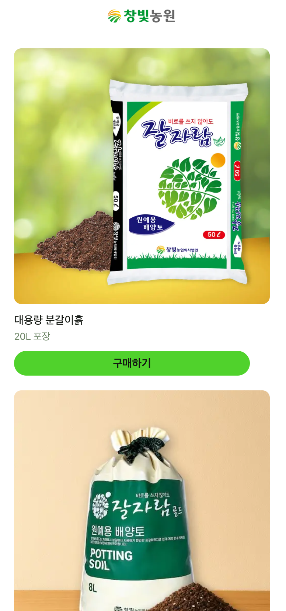

[🇺🇸 English](./README.md) | [🇰🇷 한국어](./README.ko.md)

# 🌱 Potting Soil Volume Calculator
> React, TypeScript, Vite로 제작한 실전형 흙 계산기 — 빠르고 반응형이며, SEO와 운영 최적화까지 고려한 제품 수준의 프로젝트입니다.

화분의 형태와 크기를 입력하면, 분갈이에 필요한 흙의 양을 간편하게 계산해주는 웹 도구입니다.

## 왜 이 프로젝트를 만들었나요?
초보 가드너를 위한 실용적인 도구로 이 계산기를 만들었습니다. UX부터 배포와 SEO까지 전체 개발을 직접 주도한 프론트엔드 제품이라는 점을 보여주기 위해 제작했습니다.

- 사용자 입력값에 대한 철저한 검증
- 도메인 기반 로직 (필요량 계산, 흙 부피 추정)
- 최적의 제품 조합 추천 알고리즘
- 모바일 최적화, SEO, 분석 태깅까지 실전 대응

<p align="center">
  
  
  
</p>

### 👉 [바로 사용해보기](https://soilcalc.changbitfarm.com)

## 주요 기능
- 사각형, 원통형, 원뿔형, 기타형 등 4가지 화분 형태 지원
- 흙을 80%만 채운다는 현실적인 기준 반영
- 20L + 8L 조합 기반 추천 제품 안내
- 반응형 SPA, 빠른 로딩 (Vite + React 기반)
- Open Graph, favicon, sitemap, analytics 등 SEO 최적화

## 기술 스택
- 프론트엔드: React + TypeScript + Tailwind CSS
- 빌드 도구: Vite
- 배포: Netlify
- SEO: Open Graph 메타태그, 커스텀 sitemap.xml, robots.txt
- 분석: Google Analytics (GA4)
- 테스트: Jest + ts-jest (100% 커버리지)

## 테스트 방법
유닛 테스트 실행:
```bash
npm test
npm run test:coverage
```

## 핵심 코드 하이라이트

- [흙 부피 계산 로직](./src/utils/calculator.ts)
- [100% 커버리지 유닛 테스트](./src/utils/calculator.test.ts)
- [제품 조합 추천 로직](./src/utils/breakdown.ts)
- [화분 형태 선택 컴포넌트](./src/components/ShapeSelector.tsx)

## 제품 완성도
- HTTPS 자동 적용 (Netlify)
- 런타임 백엔드 없음 → 보안성과 유지관리 간편
- Googlebot, 카카오톡 공유 대응 (og:image 등 메타태그 설정)
- main 브랜치에서 Netlify로 자동 배포

---
Made with 🧡 by Nami Kim
[Blog](https://namixkim.com) | [GitHub](https://github.com/namikimlab) | [LinkedIn](https://linkedin.com/in/namixkim)